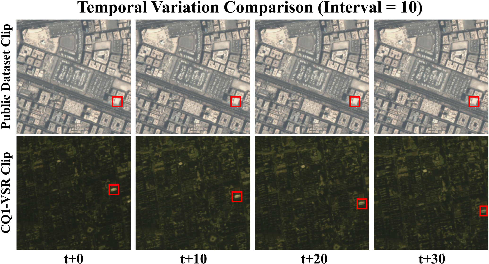
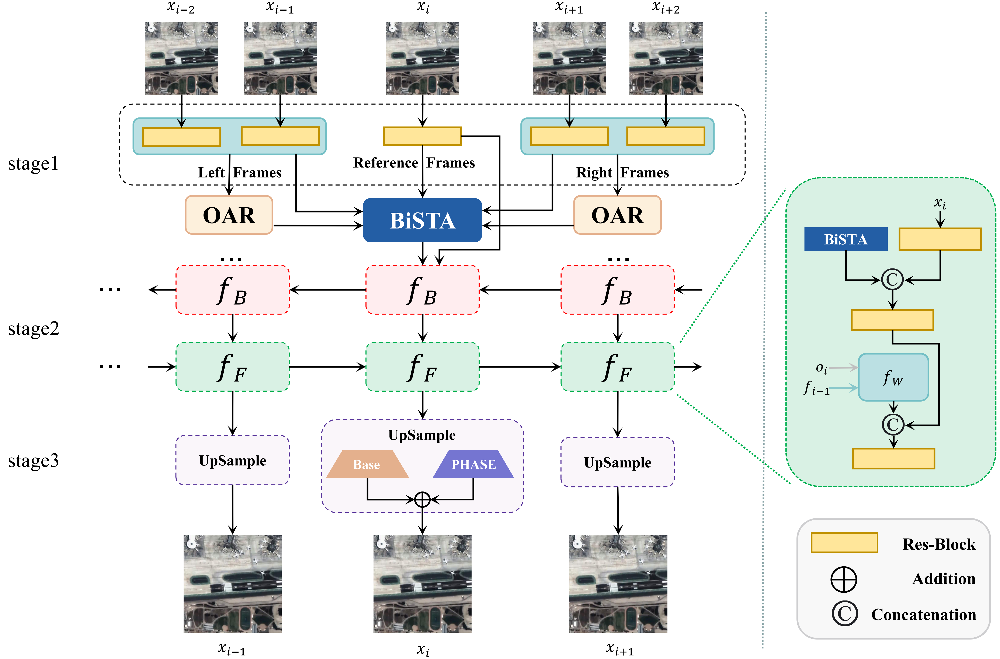
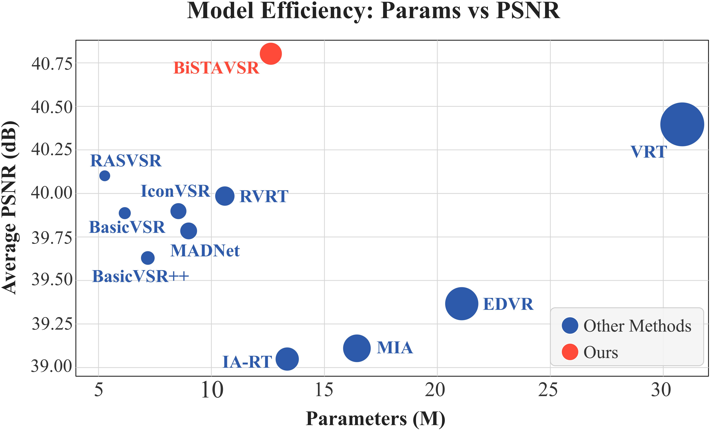
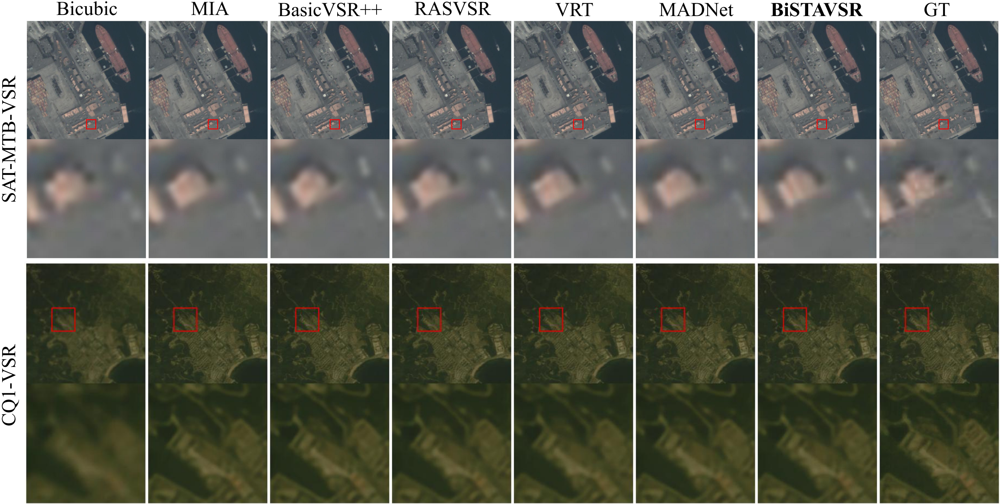

<div align="center">

# BiSTAVSR

### Offset-Aware Bidirectional Spatio-Temporal Aggregation for Remote Sensing Video Super-Resolution

[](https://github.com/HIAS-Zhao/Video-super-resolution)
[](https://pytorch.org/)
[](https://github.com/XPixelGroup/BasicSR)
[](./BiSTAVSR.pdf)

[**Manuscript**](./BiSTAVSR.pdf) | [**Code**](https://github.com/HIAS-Zhao/Video-super-resolution) | [**Release Status**](#release-status)

</div>

## Abstract

High-resolution satellite videos are essential for video-based remote sensing analysis, yet their acquisition and transmission are constrained by sensor bandwidth, onboard storage, and downlink capacity. Remote sensing video super-resolution (RSVSR) aims to recover high-resolution video sequences from low-resolution satellite observations. Compared with natural videos, satellite videos pose distinctive challenges due to platform-induced motion, weak local textures, and dense structure-sensitive details. Existing RSVSR methods are often evaluated on datasets with limited temporal variation, whereas realistic satellite videos exhibit stronger frame-to-frame changes. To better reflect such temporal conditions, we construct CQ1-VSR from original satellite videos without precise inter-frame registration. The HR source sequences are real satellite observations, and the paired LR inputs are generated through a documented clip-consistent degradation pipeline. We propose BiSTAVSR, a recurrent video restoration framework that enhances local spatio-temporal aggregation within long-range propagation. It incorporates bidirectional local attention, structure-guided offset refinement, and an explicit high-frequency enhancement branch to improve spatio-temporal feature utilization and detail reconstruction. Experiments on SAT-MTB-VSR and CQ1-VSR demonstrate that BiSTAVSR achieves favorable quantitative performance and visual quality, particularly in regions with complex motion and fine structural details. Code, models, degradation scripts, and dataset splits will be made available through this repository.

> **Implementation note:** BiSTAVSR is built on MADNet and retains its MADE feature enhancement and EDVR keyframe branch. The current release provides the model architecture and the BasicSR-based training and evaluation pipeline.

## Highlights

- **BiSTA** separates local past and future support frames and aggregates them with shared flow-guided deformable attention before injecting the resulting evidence into recurrent propagation.
- **OAR** uses fixed Scharr responses and a lightweight, Gaussian-initialized learnable context pathway to refine query-key guidance and offset prediction.
- **PHASE** combines a fixed structural prior, learnable directional detail encoding, and a learnable fusion coefficient for high-frequency compensation.
- **CQ1-VSR** is constructed from original real satellite videos. Its HR sequences retain real-source temporal variation, while paired LR inputs are generated through clip-consistent synthetic degradation.

## Temporal Variation

Compared with a representative public benchmark clip, CQ1-VSR retains stronger platform-induced frame-to-frame displacement in its original satellite observations. The example below shows frames sampled at an interval of 10.

<p align="center">
  
</p>

## Architecture

<p align="center">
  
</p>

The framework performs target-centered BiSTA aggregation with OAR guidance, bidirectional recurrent propagation, and dual-branch reconstruction with PHASE detail enhancement.

## Results

The following results use `x4` upscaling and 15 input frames. PSNR and SSIM are evaluated on the luminance channel; lower LPIPS is better.

| Method | Params | Dataset | PSNR | SSIM | LPIPS |
|:--|--:|:--|--:|--:|--:|
| BiSTAVSR | 12.6M | SAT-MTB-VSR | **40.7814** | **0.9713** | **0.1214** |
| BiSTAVSR | 12.6M | CQ1-VSR | **41.4101** | **0.9629** | **0.2951** |

### Efficiency

<p align="center">
  
</p>

## Visual Results

The qualitative comparison below shows representative `x4` reconstruction results on SAT-MTB-VSR and CQ1-VSR. BiSTAVSR recovers clearer structural boundaries and preserves finer scene details under complex inter-frame motion.

<p align="center">
  
</p>

## Installation

Clone the repository and install the dependencies in a PyTorch environment compatible with your CUDA version.

```bash
git clone https://github.com/HIAS-Zhao/Video-super-resolution.git
cd Video-super-resolution
python -m pip install -r requirements.txt
python -m pip install -e .
```

Linux with an NVIDIA GPU is recommended. The frozen `requirements.txt` records the development environment; a compatible PyTorch/CUDA combination may be substituted when necessary.

## Data Preparation

BiSTAVSR is evaluated on **SAT-MTB-VSR** and **CQ1-VSR**. Arrange each dataset as consecutive video-frame folders, with matching sequence and frame names under the GT and LR directories. One possible layout is:

```text
data/
|-- <dataset>/
|   |-- train/
|   |   |-- GT/
|   |   |-- LR4x/
|   |   `-- meta_info_train_GT.txt
|   |-- val/
|   |   |-- GT/
|   |   `-- LR4x/
|   `-- test/
|       |-- GT/
|       `-- LR4x/
```

Update `dataroot_gt`, `dataroot_lq`, and `meta_info_file` in the corresponding YAML file before training or evaluation. Existing BasicSR data-preparation utilities can be found in `scripts/data_preparation/`.

## Pretrained Dependencies

BiSTAVSR uses pretrained SPyNet weights for optical-flow estimation. Place the checkpoint at the path configured by `spynet_path`, for example:

```text
experiments/pretrained_models/spynet_sintel_final-3d2a1287.pth
```

The EDVR keyframe branch is not initialized from an external checkpoint in the provided training configuration; it is optimized jointly with the remaining network. For evaluation, set `pretrain_network_g` in the test YAML file to the BiSTAVSR checkpoint path.

## Training

### Single GPU

```bash
python basicsr/train.py -opt options/train/BiSTAVSR/train_BiSTAVSR.yml
```

### Distributed Training

```bash
bash scripts/dist_train.sh 4 options/train/BiSTAVSR/train_BiSTAVSR.yml
```

The provided configuration uses 15-frame clips, `64 x 64` LR crops (`256 x 256` GT), a batch size of 4 per GPU, Adam optimization, Charbonnier loss, and 100,000 iterations. Modify the YAML file to match the target dataset and hardware.

## Evaluation

### Single GPU

```bash
python basicsr/test.py -opt options/test/BiSTAVSR/test_BiSTAVSR.yml
```

### Distributed Evaluation

```bash
bash scripts/dist_test.sh 4 options/test/BiSTAVSR/test_BiSTAVSR.yml
```

Restored frames and metric logs are written to the BasicSR results directory specified by the runtime configuration.

## Repository Structure

```text
Video-super-resolution/
|-- assets/                         # README figures
|-- basicsr/
|   |-- archs/
|   |   |-- BiSTAVSR.py             # Main BiSTAVSR architecture
|   |   |-- bistavsr_arch.py        # BasicSR registry entry
|   |   `-- function.py             # BiSTA, OAR, PHASE, and related modules
|   `-- ...
|-- options/
|   |-- train/BiSTAVSR/
|   `-- test/BiSTAVSR/
|-- scripts/                        # Distributed and data-preparation scripts
|-- BiSTAVSR.pdf                    # Manuscript
|-- requirements.txt
`-- setup.py
```

## Release Status

| Item | Status |
|:--|:--|
| Model architecture | Available |
| Training and evaluation code | Available |
| Training and test configurations | Available |
| Manuscript | Available |
| Pretrained BiSTAVSR checkpoints | In preparation |
| CQ1-VSR dataset, splits, and degradation scripts | In preparation |

## Citation

The manuscript is currently under review at **IEEE Transactions on Circuits and Systems for Video Technology (TCSVT)**. Final bibliographic information and a BibTeX entry will be added after publication. In the meantime, please refer to the manuscript by its title:

> *Offset-Aware Bidirectional Spatio-Temporal Aggregation for Remote Sensing Video Super-Resolution*

## Acknowledgements

This project is developed on top of [BasicSR](https://github.com/XPixelGroup/BasicSR) and uses the SPyNet implementation and recurrent VSR infrastructure provided by the open-source restoration community. We thank the authors and contributors of these projects.
