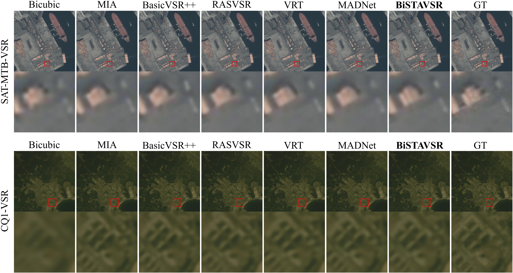

# BiSTAVSR: Offset-Aware Bidirectional Spatio-Temporal Aggregation for Remote Sensing Video Super-Resolution

These supplementary materials provide the implementation of **BiSTAVSR** for remote sensing video super-resolution (RSVSR).

BiSTAVSR is designed for realistic satellite videos with large inter-frame motion, weak local textures, and dense structural details. It combines:

- **BiSTA**: Bidirectional Spatio-Temporal Attention Aggregation
- **OAR**: Offset-Aware Refinement
- **PHASE**: Pyramidal High-frequency Auxiliary Structure Enhancement

---

## Abstract

Remote sensing videos are a special type of sequential multimedia data and pose distinctive super-resolution challenges due to large platform-induced motion, weak textures, and complex structural details. To address these issues, we propose **BiSTAVSR**, a recurrent remote sensing video super-resolution framework that strengthens local bidirectional aggregation within long-range propagation. Specifically, the proposed method introduces a **Bidirectional Spatio-Temporal Attention Aggregation (BiSTA)** module for enhanced neighboring-frame support, an **Offset-Aware Refinement (OAR)** module for more reliable query-key matching and offset estimation, and a **Pyramidal High-frequency Auxiliary Structure Enhancement (PHASE)** branch for explicit high-frequency reconstruction during upsampling. Experiments on public and real-world datasets demonstrate that BiSTAVSR achieves strong quantitative and visual performance.

---

## Network


---

## Highlights

- Recurrent RSVSR framework with enhanced local bidirectional aggregation
- Explicit structural guidance for query-key matching and offset prediction
- Dual-branch reconstruction with dedicated high-frequency enhancement
- Effective on both public benchmarks and realistic satellite videos

---

## Environment

- Python 3.8+
- PyTorch 2.0+
- CUDA 11.8+
- Linux recommended

Please adjust the environment according to your hardware and dependency versions.

---

## Dataset

We evaluate BiSTAVSR on the following datasets:

### SAT-MTB-VSR
A public benchmark for satellite video super-resolution. It contains 413 training sequences and 18 validation sequences, and each sequence has 100 frames with a spatial resolution of 640×640.

### CQ1-VSR
A real-world remote sensing video super-resolution dataset constructed from original satellite videos. Compared with public benchmarks, CQ1-VSR contains larger frame-to-frame variation and more realistic scene motion.

### Dataset Download

Please download the datasets from the corresponding links and organize them as follows:

```bash
data/
├── SAT-MTB-VSR/
│   ├── train/
│   │   ├── GT/
│   │   └── LR4x/
│   └── val/
├── CQ1-VSR/
│   ├── train/
│   │   ├── GT/
│   │   └── LR4x/
│   ├── val/
│   └── test/
```

> Replace the folder names above with your actual dataset structure if it is different from this example.

---

## Dataset Preparation

If needed, you can convert the dataset into **LMDB** format for faster training and data loading:

```bash
python scripts/data_preparation/create_lmdb.py
```

Please modify the dataset paths in the script or option files before running it.

Notes:

- **SPyNet** is used for optical flow estimation.
- Other BiSTAVSR modules are trained from scratch.
- Please update the path in the option files if your directory structure is different.

---

## Directory Structure

A recommended project structure is as follows:

```bash
BiSTAVSR/
├── assets/
├── basicsr/
├── data/
├── experiments/
│   ├── pretrained_models/
│   └── ...
├── options/
│   ├── train/
│   │   └── BiSTAVSR/
│   │       └── train_BiSTAVSR.yml
│   └── test/
│       └── BiSTAVSR/
│           └── test_BiSTAVSR.yml
├── scripts/
├── README.md
├── requirements.txt
└── setup.py
```

---

## Quick Start

### 1. Install dependencies

```bash
cd BiSTAVSR
pip install -r requirements.txt
python setup.py develop
```

### 2. Prepare datasets

Place the datasets under:

```bash
data/
```

### 3. Download pretrained models

Put the pretrained weights into:

```bash
experiments/pretrained_models/
```

### 4. Run evaluation

```bash
python basicsr/test.py -opt options/test/BiSTAVSR/test_BiSTAVSR.yml
```

For distributed evaluation, use:

```bash
bash scripts/dist_test.sh 4 options/test/BiSTAVSR/test_BiSTAVSR.yml
```

---

## Training

BiSTAVSR is trained for **×4 remote sensing video super-resolution**.
The model takes **15 consecutive LR frames** as input.

### Single GPU

```bash
python basicsr/train.py -opt options/train/BiSTAVSR/train_BiSTAVSR.yml
```

### Multi-GPU

```bash
bash scripts/dist_train.sh 4 options/train/BiSTAVSR/train_BiSTAVSR.yml
```

### Main Training Settings

- Input: **15-frame LR clips**
- Patch size: **64 × 64**
- Batch size: **4**
- Optimizer: **Adam**
- Initial learning rate: **2e-4**
- Scheduler: **CosineAnnealingRestartLR**
- Iterations: **100,000**
- Loss: **Charbonnier loss**
- Data augmentation: **random horizontal and vertical flipping**

Please modify the option file according to your environment and training setup.

---

## Test

```bash
python basicsr/test.py -opt options/test/BiSTAVSR/test_BiSTAVSR.yml
```

The restored results will be saved to:

```bash
results/
```

---

## Evaluation

We use the following metrics for evaluation:

- **PSNR**
- **SSIM**
- **LPIPS**

Unless otherwise specified, quantitative results are reported on the **Y channel**.

---

## Results

### Quantitative Results


### Qualitative Results



---

## Acknowledgement

This project is built upon [BasicSR](https://github.com/XPixelGroup/BasicSR).
We also thank the authors of related open-source VSR and RSVSR projects for their valuable implementations.

---

## TODO

- [ ] Release training code
- [ ] Release testing code
- [ ] Release pretrained models
- [ ] Release dataset links
- [ ] Update paper link after publication

